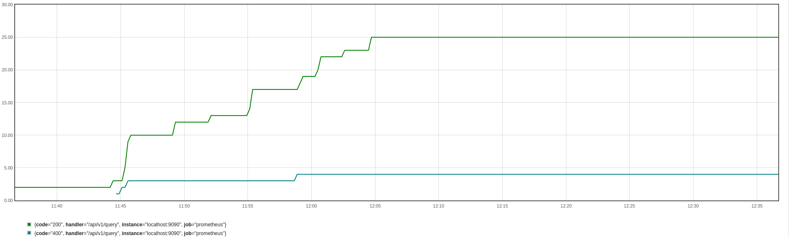

# Funções básicas do Prometheus

### Rate

A função rate representa a taxa de crescimento por segundo de uma determinada métrica como média, durante um intervalo de tempo.

```PROMQL
rate(metrica[X])
```

Onde `metrica` é a métrica que você deseja calcular a taxa de crescimento durante um intervalo de tempo de X minutos. Você pode utilizar a função `rate` para trabalhar com métricas do tipo `gauge` e `counter`.

```PROMQL
rate(prometheus_http_requests_total{job="prometheus",handler="/api/v1/query"}[15m])
```


### IRate

A função `irate` representa a taxa de crescimento por segundo de uma determinada métrica, mas diferentemente da função `rate`, a função `irate` não faz a média dos valores, ela pega os dois últimos pontos e calcula a taxa de crescimento. Quando representado em um gráfico, é possível ver a diferença entre a função `rate` e a função `irate`, enquanto o gráfico com o `rate` é mais suave, o gráfico com o `irate` é mais "pontiagudo", você consegue ver quedas e subidas mais nítidas.

```PROMQL
irate(metrica[X])
```

Onde `metrica` é a métrica que você deseja calcular a taxa de crescimento, considerando somente os dois últimos pontos, durante um intervalo de tempo de X minutos.

```PROMQL
rate(prometheus_http_requests_total{job="prometheus",handler="/api/v1/query"}[15m])
```


### Delta

A função `delta` representa a diferença entre o valor atual e o valor anterior de uma métrica. Quando estamos falando de `delta` estamos falando por exemplo do consumo de um disco. Vamos imaginar que eu queira saber o quando eu usei de disco em um determinado intervalo de tempo, eu posso utilizar a função `delta` para calcular a diferença entre o valor atual e o valor anterior. 

```PROMQL
delta(metrica[X])
```

Onde `metrica` é a métrica que você deseja calcular a diferença entre o valor atual e o valor anterior, durante um intervalo de tempo de X minutos.

```PROMQL
delta(prometheus_http_response_size_bytes_count{job="prometheus",handler="/api/v1/query"}[5m])
```


### Increase

Da mesma forma que a função `delta`, a função `increase` representa a diferença entre o primeiro e último valor durante um intervalo de tempo, porém a diferença é que a função `increase` considera que o valor é um contador, ou seja, o valor é incrementado a cada vez que a métrica é atualizada.
Ela começa com o valor 0 e vai somando o valor da métrica a cada atualização.
Ela trabalha com tipo de métrica counter.

```PROMQL
increase(metrica[X])
```

Onde `metrica` é a métrica que você deseja calcular a diferença entre o primeiro e último valor durante um intervalo de tempo de X minutos.

```PROMQL
increase(prometheus_http_requests_total{job="prometheus",handler="/api/v1/query"}[5m])
```


### Sum

A função `sum` representa a soma de todos os valores de uma métrica. 
Você pode utilizar a função `sum` nos tipos de dados `counter`, `gauge`, `histogram` e `summary`.
Um exemplo de uso da função `sum` é quando você quer saber o quanto de memória está sendo utilizada por todos os seus containers, ou o quanto de memória está sendo utilizada por todos os seus pods.

```PROMQL
sum(metrica)
```

Onde `metrica` é a métrica que você deseja somar.

```PROMQL
sum(go_memstats_alloc_bytes{job="prometheus"})
```

Aqui estou somando todos os valores da métrica `go_memstats_alloc_bytes`, filtrando por `job` e durante um intervalo de tempo de 5 minutos.


### Count

Outra função bem utilizada é função `count` representa o contador de uma métrica.
Você pode utilizar a função `count` nos tipos de dados `counter`, `gauge`, `histogram` e `summary`.
Um exemplo de uso da função `count` é quando você quer saber quantos containers estão rodando em um determinado momento ou quantos de seus pods estão em execução.
  
```PROMQL
count(metrica)
```

Onde `metrica` é a métrica que você deseja contar.

```PROMQL
count(prometheus_http_requests_total)
```

Teremos como resultado o número de valores que a métrica `prometheus_http_requests_total` possui.


### Avg

A função `avg` representa o valor médio de uma métrica.
Você pode utilizar a função `avg` nos tipos de dados `counter`, `gauge`, `histogram` e `summary`.
Essa é uma das funções mais utilizadas, pois é muito comum você querer saber o valor médio de uma métrica, por exemplo, o valor médio de memória utilizada por um container.

```PROMQL
avg(metrica)
```

Onde `metrica` é a métrica que você deseja calcular a média.

```PROMQL
avg(prometheus_http_requests_total{handler="/api/v1/query",job="prometheus"})
```


### Min

A função `min` representa o valor mínimo de uma métrica.
Você pode utilizar a função `min` nos tipos de dados `counter`, `gauge`, `histogram` e `summary`.
Um exemplo de uso da função `min` é quando você quer saber qual o menor valor de memória utilizada por um container.

```PROMQL
min(metrica)
```

Onde `metrica` é a métrica que você deseja calcular o mínimo.

```PROMQL
min(prometheus_http_requests_total{handler="/api/v1/query",job="prometheus"})
```


### Max

A função `max` representa o valor máximo de uma métrica.
Um exemplo de uso da função `max` é quando você quer saber qual o maior valor de memória pelos nodes de um cluster Kubernetes.

```PROMQL
max(metrica)
```

Onde `metrica` é a métrica que você deseja calcular o máximo.

```PROMQL
max(prometheus_http_requests_total{handler="/api/v1/query",job="prometheus"})
```


### Avg_over_time

A função `avg_over_time` representa a média de uma métrica durante um intervalo de tempo.
Normalmente utilizada para calcular a média de uma métrica durante um intervalo de tempo, como por exemplo, a média de requisições por segundo durante um intervalo de tempo ou ainda as pessoas que estão no espaço durante o último ano. :D

```PROMQL
avg_over_time(metrica[5m])
```

Onde `metrica` é a métrica que você deseja calcular a média durante um intervalo de tempo de 5 minutos.

```PROMQL
avg_over_time(prometheus_http_requests_total{handler="/api/v1/query"}[5m])
```

Agora estou calculando a média da métrica `prometheus_http_requests_total`, filtrando por `handler` e durante um intervalo de tempo de 5 minutos.


### Sum_over_time

Também temos a função `sum_over_time`, que representa a soma de uma métrica durante um intervalo de tempo. Vimos a `avg_over_time` que representa a média, a `sum_over_time` representa a soma dos valores durante um intervalo de tempo.
Imagina calcular a soma de uma métrica durante um intervalo de tempo, como por exemplo, a soma de requisições por segundo durante um intervalo de tempo ou ainda a soma de pessoas que estão no espaço durante o último ano.

```PROMQL
sum_over_time(metrica[5m])
```

Onde `metrica` é a métrica que você deseja calcular a soma durante um intervalo de tempo de 5 minutos.

```PROMQL
sum_over_time(prometheus_http_requests_total{handler="/api/v1/query"}[5m])
```

Agora estou calculando a soma da métrica `prometheus_http_requests_total`, filtrando por `handler` e durante um intervalo de tempo de 5 minutos.


### max_over_time

A função `max_over_time` representa o valor máximo de uma métrica durante um intervalo de tempo.

```PROMQL
max_over_time(metrica[5m])
```

Onde `metrica` é a métrica que você deseja calcular o valor máximo durante um intervalo de tempo de 5 minutos.

```PROMQL
max_over_time(prometheus_http_requests_total{handler="/api/v1/query"}[5m])
```

Agora estamos buscando o valor máximo da métrica `prometheus_http_requests_total`, filtrando por `handler` e durante um intervalo de tempo de 5 minutos.




### Min_over_time

A função `min_over_time` representa o valor mínimo de uma métrica durante um intervalo de tempo.

```PROMQL
min_over_time(metrica[5m])
```

Onde `metrica` é a métrica que você deseja calcular o valor mínimo durante um intervalo de tempo de 5 minutos.

```PROMQL
min_over_time(prometheus_http_requests_total{handler="/api/v1/query"}[5m])
```

Agora estamos buscando o valor mínimo da métrica `prometheus_http_requests_total`, filtrando por `handler` e durante um intervalo de tempo de 5 minutos.


### Stddev_over_time

A função `stddev_over_time` representa o desvio padrão, que são os valores que estão mais distantes da média, de uma métrica durante um intervalo de tempo.
Um bom exemplo seria para o calculo de desvio padrão para saber se houve alguma anomalia no consumo de disco, por exemplo.

```PROMQL
stddev_over_time(metrica[5m])
```

Onde `metrica` é a métrica que você deseja calcular o desvio padrão durante um intervalo de tempo de 5 minutos.

```PROMQL
stddev_over_time(prometheus_http_requests_total{handler="/api/v1/query"}[10m])
```

Agora estamos buscando os desvios padrões da métrica `prometheus_http_requests_total`, filtrando por `handler` e durante um intervalo de tempo de 10 minutos. Vale a pena verificar o gráfico, pois facilita a visualização dos valores.


### By

A sensacional e super utilizada função `by` é utilizada para agrupar métricas. Com ela é possível agrupar métricas por labels, por exemplo, se eu quiser agrupar todas as métricas que possuem o label `job` eu posso utilizar a função `by` da seguinte forma:

```PROMQL
sum(metrica) by (job)
```

Onde `metrica` é a métrica que você deseja agrupar e `job` é o label que você deseja agrupar.

```PROMQL
sum(prometheus_http_requests_total) by (code)
```

Agora estamos somando a métrica `prometheus_http_requests_total` e agrupando por `code`, assim sabemos quantas requisições foram feitas por código de resposta.


### Without

A função `without` é utilizada para remover labels de uma métrica. 
Você pode utilizar a função `without` nos tipos de dados `counter`, `gauge`, `histogram` e `summary` e frequentemente usado em conjunto com a função `sum`.

Por exemplo, se eu quiser remover o label `job` de uma métrica, eu posso utilizar a função `without` da seguinte forma:

```PROMQL
sum(metrica) without (job)
```

Onde `metrica` é a métrica que você deseja remover o label `job`.

```PROMQL
sum(prometheus_http_requests_total) without (handler)
```

Agora estamos somando a métrica `prometheus_http_requests_total` e removendo o label `handler`, assim sabemos quantas requisições foram feitas por código de resposta, sem saber qual handler foi utilizado para ter uma visão mais geral e focado no código de resposta.


### Histogram_quantile e quantile

As funções `histogram_quantile` e `quantile` são muito parecidas, porém a `histogram_quantile` é utilizada para calcular o percentil de uma métrica do tipo `histogram` e a `quantile` é utilizada para calcular o percentil de uma métrica do tipo `summary`.
Basicamente utilizamos esses funções para saber qual é o valor de uma métrica em um determinado percentil.

```PROMQL
quantile(0.95, metrica)
```

Onde `metrica` é a métrica do tipo `histogram` que você deseja calcular o percentil e `0.95` é o percentil que você deseja calcular.

```PROMQL
quantile(0.95, prometheus_http_request_duration_seconds_bucket)
```

Agora estamos calculando o percentil de 95% da métrica `prometheus_http_request_duration_seconds_bucket`, assim sabemos qual é o tempo de resposta de 95% das requisições.

